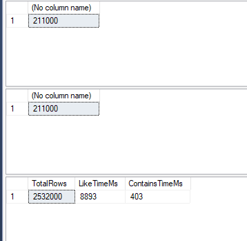

# SQL Server Full-Text Index ile Arama Performansını Artırma

<br>


## Kısaca

Metin sorgularında `LIKE '%arama_terimi%'` ile arama yapmak yerine, `WHERE CONTAINS(arama_terimi, 'telefon');` arama yapar. `Full-Text Index` metinsel aramaları hızlandırmaktadır.


<br>

## 🚀 Giriş

Büyük veri setlerinde metin aramaları yaparken performans sorunları yaşıyor musunuz? SQL Server'ın `LIKE` operatörü ile yapılan aramalar veritabanınızı yavaşlatıyor mu? Bu yazıda, SQL Server Full-Text Index özelliğini kullanarak arama performansınızı nasıl **22 kata kadar** artırabileceğinizi göstereceğim.

<br>

## 📊 Problem: Geleneksel LIKE Aramalarının Performans Sorunu

Bir e-ticaret platformunda veya destek sisteminde milyonlarca kayıt içinde arama yapmak zorunda kaldığınızı düşünün. Geleneksel `LIKE '%arama_terimi%'` sorguları:

- ✗ Tüm tabloyu baştan sona tarar
- ✗ Index kullanamaz
- ✗ Büyük veri setlerinde çok yavaştır
- ✗ CPU ve I/O yükünü artırır

<br>

## 💡 Çözüm: SQL Server Full-Text Index

Full-Text Index, metin verilerinde hızlı arama yapmak için özel olarak tasarlanmış bir özelliktir. Normal index'lerden farklı olarak, kelimeleri ve konumlarını özel bir yapıda saklar.

<br>

### 🎯 Full-Text Index'in Avantajları

1. **Hız**: LIKE sorgularına göre 5-25x daha hızlı
2. **Gelişmiş Arama**: Kelime kökleri, eş anlamlılar, yakınlık aramaları
3. **Dil Desteği**: 50+ dil için optimize edilmiş arama
4. **Ölçeklenebilirlik**: Milyonlarca kayıtta bile hızlı sonuç

<br>

## 🔬 Gerçek Dünya Örneği: Performans Karşılaştırması

### Test 1: 1.2 Milyon Kayıt


- **LIKE Sorgusu**: 4,215 ms
- **CONTAINS (Full-Text)**: 772 ms
- **Performans Artışı**: ~5.5x

<br>

### Test 2: 2.5 Milyon Kayıt



- **TotalRows**: 2,532,000
- **LIKE Sorgusu**: 8,893 ms
- **CONTAINS (Full-Text)**: 403 ms
- **Performans Artışı**: ~22x 🚀

<br>

## 🛠️ Full-Text Index Nasıl Oluşturulur?

### 1. Full-Text Catalog Oluşturma

```sql
-- Full-Text Catalog oluştur
CREATE FULLTEXT CATALOG ft_catalog AS DEFAULT;
```

### 2. Full-Text Index Oluşturma

```sql
-- DestekTurler tablosu için Full-Text Index
CREATE FULLTEXT INDEX ON dbo.DestekTurler
(
    Ad LANGUAGE Turkish,
    Aciklama LANGUAGE Turkish
)
KEY INDEX PK_DestekTurler -- Primary Key index adı
ON ft_catalog
WITH (CHANGE_TRACKING = AUTO);
```

### 3. Full-Text Arama Kullanımı

```sql
-- Eski yöntem (YAVAŞ)
SELECT * FROM DestekTurler 
WHERE Ad LIKE '%telefon%' OR Aciklama LIKE '%telefon%';

-- Yeni yöntem (HIZLI)
SELECT * FROM DestekTurler 
WHERE CONTAINS((Ad, Aciklama), 'telefon');
```

<br>

## 🎨 Gelişmiş Arama Özellikleri

### 1. Birden Fazla Kelime Arama
```sql
-- "telefon" VE "destek" kelimelerini içeren kayıtlar
SELECT * FROM DestekTurler 
WHERE CONTAINS(*, '"telefon" AND "destek"');
```

### 2. Yakınlık Araması
```sql
-- "müşteri" ve "hizmet" kelimeleri arasında max 5 kelime olan kayıtlar
SELECT * FROM DestekTurler 
WHERE CONTAINS(*, 'NEAR((müşteri, hizmet), 5)');
```

### 3. Ağırlıklı Arama
```sql
-- Farklı kelimelere farklı ağırlık vererek arama
SELECT * FROM DestekTurler 
WHERE CONTAINS(*, 'ISABOUT(telefon WEIGHT(0.8), destek WEIGHT(0.4))');
```

<br>

## 📈 Performans İpuçları

### 1. Sayfalama Optimizasyonu

Büyük veri setlerinde sayfalama yaparken, son görülen ID'yi kullanarak daha hızlı sonuçlar alabilirsiniz:

```sql
-- Klasik sayfalama (YAVAŞ)
SELECT * FROM DestekTurler 
WHERE CONTAINS(*, 'telefon')
ORDER BY Id DESC
OFFSET 1000 ROWS FETCH NEXT 50 ROWS ONLY;

-- Optimized sayfalama (HIZLI)
SELECT TOP 50 * FROM DestekTurler 
WHERE Id < @LastSeenId AND CONTAINS(*, 'telefon')
ORDER BY Id DESC;
```

### 2. İndeks Bakımı

```sql
-- Full-Text index'i yeniden oluştur
ALTER FULLTEXT INDEX ON DestekTurler REBUILD;

-- Değişiklikleri hemen uygula
ALTER FULLTEXT INDEX ON DestekTurler START UPDATE POPULATION;
```

<br>

## ⚠️ Dikkat Edilmesi Gerekenler

1. **İlk Kurulum Süresi**: Mevcut büyük tablolarda Full-Text index oluşturmak zaman alabilir
2. **Disk Alanı**: Full-Text katalogları ek disk alanı gerektirir (~%10-30)
3. **Senkronizasyon**: Varsayılan olarak otomatik senkronize olur ancak gecikme olabilir
4. **Kelime Sınırları**: Çok kısa kelimeler (1-2 karakter) indekslenmeyebilir

<br>

## 🎯 Sonuç ve Kazanımlar

Full-Text Index kullanarak:
- ✅ Web sorgularında **10 saniyeden 1 saniyeye** düşüş
- ✅ 2.5M kayıtta servis katmanında **635ms** (filtresiz), **1.46s** (filtreli) yanıt süresi
- ✅ Kullanıcı deneyiminde büyük iyileşme
- ✅ Sunucu kaynaklarında tasarruf

<br>

## 📚 Kaynaklar

-[Kamil Gün Medium](https://medium.com/@kamillgun/full-text-search-e22a1251539)
- [SQL Server Full-Text Search Documentation](https://docs.microsoft.com/en-us/sql/relational-databases/search/full-text-search)
- [MSSQL Tips - Add Full-Text Search](https://www.mssqltips.com/sqlservertip/6841/add-full-text-search-sql-server/)
- [Performance Tuning Full-Text Queries](https://docs.microsoft.com/en-us/sql/relational-databases/search/improve-the-performance-of-full-text-queries)

<br>

💡 **Pro Tip**: Full-Text Index'i production ortamında kullanmadan önce mutlaka test ortamında deneyin ve performans metriklerini ölçün. Her veri seti farklı davranabilir!

🚀 **Hemen Deneyin**: Projenizde metin araması yapılan tablolarınızı belirleyin ve Full-Text Index'in size sağlayacağı performans artışını test edin.

